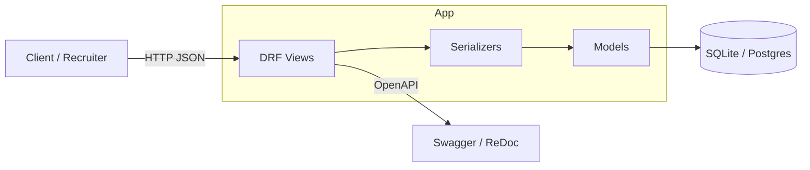
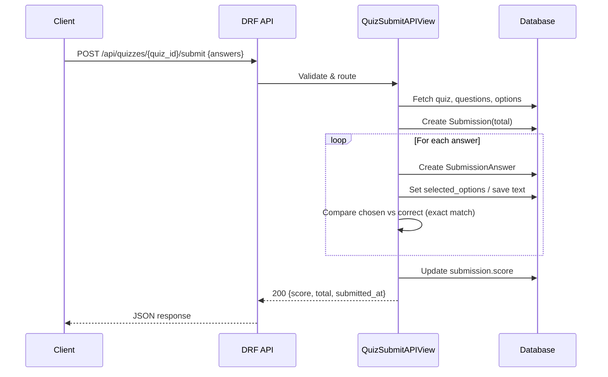

# 🎯 Online Quiz Application API

A backend API for creating and managing quizzes, adding questions, and submitting answers with scoring.  
Built using **Python + Django REST Framework** for the Verto hiring challenge.

[

](https://www.python.org/) [

](https://www.djangoproject.com/) [

](https://www.django-rest-framework.org/) [

](./LICENSE) [

](./swagger/)

---

## 🚀 Features

- **Quiz Management**
  - Create, list, update, and delete quizzes
  - Add questions with multiple options (single choice, multiple choice, text)
  - Validation: text questions ≤ 300 chars, choice questions must have correct answers

- **Quiz Taking**
  - Fetch quiz questions (correct answers hidden)
  - Submit answers → get back `{ "score": 3, "total": 5 }`

- **Submissions**
  - Stores quiz attempts with per-question answers
  - Supports text and MCQ-based evaluation
  - Prevents invalid inputs (wrong option IDs, long text answers)

- **API Documentation**
  - Swagger UI → `/swagger/`
  - ReDoc → `/redoc/`

- **Unit Tests**
  - Covers quiz CRUD, question validation, submission scoring, and edge cases

---

## 🛠️ Tech Stack

- Python 3.11
- Django 5.x
- Django REST Framework
- drf-yasg (Swagger/Redoc API docs)
- SQLite (default, can switch to Postgres/MySQL)

---

## 📊 Visual Overview

### Architecture Diagram



### Submission Scoring Flow



---

## 📦 Setup & Installation

```bash
# Clone repository
git clone https://github.com/kiranb1301/QuizApplicationVertoChallenge.git
cd QuizApplicationVertoChallenge

# Create virtual environment
python -m venv venv
source venv/bin/activate   # On Windows: venv\Scripts\activate

# Install dependencies
pip install -r requirements.txt

# Run migrations
python manage.py migrate

# Start server
python manage.py runserver
```

---

## 🔗 Repository

- GitHub: [kiranb1301/QuizApplicationVertoChallenge](https://github.com/kiranb1301/QuizApplicationVertoChallenge)

---

## ▶️ Running Locally

- App base URL (after starting): `http://127.0.0.1:8000/`
- API base path: `http://127.0.0.1:8000/api/`
- API docs: `http://127.0.0.1:8000/swagger/` and `http://127.0.0.1:8000/redoc/`

---

## ✅ Running Tests

```bash
python manage.py test
```

This runs the Django test suite using an ephemeral SQLite test database.

---

## 🔌 Quick Endpoint Reference

- POST `/api/quizzes/` — create quiz
- GET `/api/quizzes/` — list quizzes (returns only `id` and `title`)
- GET `/api/quizzes/{quiz_id}/` — get quiz detail
- PUT `/api/quizzes/{quiz_id}/` — update quiz
- DELETE `/api/quizzes/{quiz_id}/` — delete quiz
- POST `/api/quizzes/{quiz_id}/questions/` — add question to quiz
- GET `/api/quizzes/{quiz_id}/all-questions/` — list questions (options hide `is_correct`)
- POST `/api/quizzes/{quiz_id}/submit/` — submit answers and get score
- GET/PUT/DELETE `/api/questions/{question_id}/` — question detail/update/delete

---

## 🧪 Real API Test Examples

Base URL: `http://127.0.0.1:8000/api`

All requests use `Content-Type: application/json`.

Tip: Replace placeholder values like `QUIZ_ID` and `QUESTION_ID` with real UUIDs returned by earlier requests.

### 1) Create Quiz

Request

```bash
curl -X POST "http://127.0.0.1:8000/api/quizzes/" \
  -H "Content-Type: application/json" \
  -d '{
    "title": "Python Basics Quiz",
    "instructions": "Answer all questions. No negative marking."
  }'
```

Example Response

```json
{
  "id": "8f5a2b2c-d3d8-4a30-9a05-6c3b2c9a0a11",
  "title": "Python Basics Quiz",
  "instructions": "Answer all questions. No negative marking.",
  "created_at": "2025-09-29T10:20:30.123Z",
  "total_marks": 0
}
```

### 2) List Quizzes (returns only id and title)

```bash
curl -X GET "http://127.0.0.1:8000/api/quizzes/"
```

```json
[
  { "id": "8f5a2b2c-d3d8-4a30-9a05-6c3b2c9a0a11", "title": "Python Basics Quiz" }
]
```

### 3) Get Quiz Detail

```bash
curl -X GET "http://127.0.0.1:8000/api/quizzes/8f5a2b2c-d3d8-4a30-9a05-6c3b2c9a0a11/"
```

```json
{
  "id": "8f5a2b2c-d3d8-4a30-9a05-6c3b2c9a0a11",
  "title": "Python Basics Quiz",
  "instructions": "Answer all questions. No negative marking.",
  "created_at": "2025-09-29T10:20:30.123Z",
  "total_marks": 0
}
```

### 4) Update Quiz

```bash
curl -X PUT "http://127.0.0.1:8000/api/quizzes/8f5a2b2c-d3d8-4a30-9a05-6c3b2c9a0a11/" \
  -H "Content-Type: application/json" \
  -d '{
    "title": "Python Fundamentals Quiz"
  }'
```

```json
{
  "id": "8f5a2b2c-d3d8-4a30-9a05-6c3b2c9a0a11",
  "title": "Python Fundamentals Quiz",
  "instructions": "Answer all questions. No negative marking.",
  "created_at": "2025-09-29T10:20:30.123Z",
  "total_marks": 0
}
```

### 5) Delete Quiz

```bash
curl -X DELETE "http://127.0.0.1:8000/api/quizzes/8f5a2b2c-d3d8-4a30-9a05-6c3b2c9a0a11/" -i
```

Expected: `204 No Content`

### 6) Add Question to Quiz — Single Choice

Request

```bash
curl -X POST "http://127.0.0.1:8000/api/quizzes/8f5a2b2c-d3d8-4a30-9a05-6c3b2c9a0a11/questions/" \
  -H "Content-Type: application/json" \
  -d '{
    "text": "What is the output of print(len("hello"))?",
    "type": "single",
    "order": 1,
    "options": [
      { "text": "4",   "is_correct": false },
      { "text": "5",   "is_correct": true },
      { "text": "6",   "is_correct": false }
    ]
  }'
```

Example Response (note: `is_correct` is visible on this create/detail response)

```json
{
  "id": "c7f67a5d-f2fd-4771-8c2b-9a3c9b3d2a00",
  "quiz": "8f5a2b2c-d3d8-4a30-9a05-6c3b2c9a0a11",
  "text": "What is the output of print(len(\"hello\"))?",
  "type": "single",
  "order": 1,
  "marks": 1,
  "options": [
    { "id": "2f2d1a44-9b5c-4b9f-8e38-6cdb2c8b9c01", "text": "4", "is_correct": false },
    { "id": "412bcf11-0e25-4f74-bc5d-7a4f3a1a2b02", "text": "5", "is_correct": true },
    { "id": "51a8d44b-1c77-4a6f-9a79-9d5fbc2b3c03", "text": "6", "is_correct": false }
  ]
}
```

### 7) Add Question to Quiz — Multiple Choice

```bash
curl -X POST "http://127.0.0.1:8000/api/quizzes/8f5a2b2c-d3d8-4a30-9a05-6c3b2c9a0a11/questions/" \
  -H "Content-Type: application/json" \
  -d '{
    "text": "Which are valid Python data types?",
    "type": "multiple",
    "order": 2,
    "options": [
      { "text": "list",   "is_correct": true },
      { "text": "tuple",  "is_correct": true },
      { "text": "mapping", "is_correct": false }
    ]
  }'
```

### 8) Add Question to Quiz — Text

```bash
curl -X POST "http://127.0.0.1:8000/api/quizzes/8f5a2b2c-d3d8-4a30-9a05-6c3b2c9a0a11/questions/" \
  -H "Content-Type: application/json" \
  -d '{
    "text": "Explain what a Python virtual environment is.",
    "type": "text",
    "order": 3
  }'
```

Expected: 201 with the created question (no `options`).

### 9) List All Questions for a Quiz (public view; answers hidden)

```bash
curl -X GET "http://127.0.0.1:8000/api/quizzes/8f5a2b2c-d3d8-4a30-9a05-6c3b2c9a0a11/all-questions/"
```

Example Response (no `is_correct` in options)

```json
[
  {
    "id": "c7f67a5d-f2fd-4771-8c2b-9a3c9b3d2a00",
    "quiz": "8f5a2b2c-d3d8-4a30-9a05-6c3b2c9a0a11",
    "text": "What is the output of print(len(\"hello\"))?",
    "type": "single",
    "order": 1,
    "options": [
      { "id": "2f2d1a44-9b5c-4b9f-8e38-6cdb2c8b9c01", "text": "4" },
      { "id": "412bcf11-0e25-4f74-bc5d-7a4f3a1a2b02", "text": "5" },
      { "id": "51a8d44b-1c77-4a6f-9a79-9d5fbc2b3c03", "text": "6" }
    ]
  }
]
```

### 10) Submit Answers and Get Score

Request (mix of MCQ and text)

```bash
curl -X POST "http://127.0.0.1:8000/api/quizzes/8f5a2b2c-d3d8-4a30-9a05-6c3b2c9a0a11/submit/" \
  -H "Content-Type: application/json" \
  -d '{
    "answers": [
      {
        "question": "c7f67a5d-f2fd-4771-8c2b-9a3c9b3d2a00",
        "selected_options": ["412bcf11-0e25-4f74-bc5d-7a4f3a1a2b02"]
      },
      {
        "question": "<QUESTION_ID_FOR_MULTIPLE>",
        "selected_options": ["<CORRECT_OPTION_ID_1>", "<CORRECT_OPTION_ID_2>"]
      },
      {
        "question": "<QUESTION_ID_FOR_TEXT>",
        "text_answer": "It isolates project dependencies."
      }
    ]
  }'
```

Example Response

```json
{
  "id": "0f6f8c5e-9e7c-4f4a-9b9a-6f7e9d8c1a22",
  "quiz": "8f5a2b2c-d3d8-4a30-9a05-6c3b2c9a0a11",
  "score": 2,
  "total": 3,
  "submitted_at": "2025-09-29T10:45:01.456Z"
}
```

Notes
- For MCQs, scoring requires an exact match of all correct option IDs.
- Invalid option IDs are ignored safely; only valid options belonging to the question are considered.
- Text questions are recorded but not auto-scored.

### 11) Get Question Detail

```bash
curl -X GET "http://127.0.0.1:8000/api/questions/c7f67a5d-f2fd-4771-8c2b-9a3c9b3d2a00/"
```

```json
{
  "id": "c7f67a5d-f2fd-4771-8c2b-9a3c9b3d2a00",
  "quiz": "8f5a2b2c-d3d8-4a30-9a05-6c3b2c9a0a11",
  "text": "What is the output of print(len(\"hello\"))?",
  "type": "single",
  "order": 1,
  "marks": 1,
  "options": [
    { "id": "2f2d1a44-9b5c-4b9f-8e38-6cdb2c8b9c01", "text": "4", "is_correct": false },
    { "id": "412bcf11-0e25-4f74-bc5d-7a4f3a1a2b02", "text": "5", "is_correct": true },
    { "id": "51a8d44b-1c77-4a6f-9a79-9d5fbc2b3c03", "text": "6", "is_correct": false }
  ]
}
```

### 12) Update Question (text/order)

```bash
curl -X PUT "http://127.0.0.1:8000/api/questions/c7f67a5d-f2fd-4771-8c2b-9a3c9b3d2a00/" \
  -H "Content-Type: application/json" \
  -d '{
    "text": "What is len(\"hello\")?",
    "order": 10
  }'
```

Expected: 200 with updated question. Note: changing type/options is not supported via this endpoint.

### 13) Delete Question

```bash
curl -X DELETE "http://127.0.0.1:8000/api/questions/c7f67a5d-f2fd-4771-8c2b-9a3c9b3d2a00/" -i
```

Expected: `204 No Content`

---

## 🧠 Assumptions & Design Choices

- IDs use UUIDv4 for quizzes, questions, options, and submissions.
- Validation rules enforced in serializers:
  - Text questions: no options allowed; text ≤ 300 characters.
  - Choice questions: at least 2 options; single-choice requires exactly 1 correct; multiple-choice requires ≥ 1 correct.
- Questions listing hides `is_correct` to prevent leaking answers.
- Scoring for choice questions requires an exact match of all correct options; partial matches score 0. Text questions are stored but not auto-scored.
- Submission API is tolerant to invalid option IDs; they are ignored safely.
- Pagination enabled globally via DRF with page size 5 (affects list endpoints).
- API-only responses default to JSON; browsable API is disabled for performance consistency.
- Local development uses SQLite; production can switch databases via `DATABASES` settings.
- API documentation provided via Swagger and Redoc using `drf-yasg`.
- Default `DEBUG=True` for local use; do not use in production.

---

## 📄 License

This project is licensed under the MIT License. See `LICENSE` for details.
